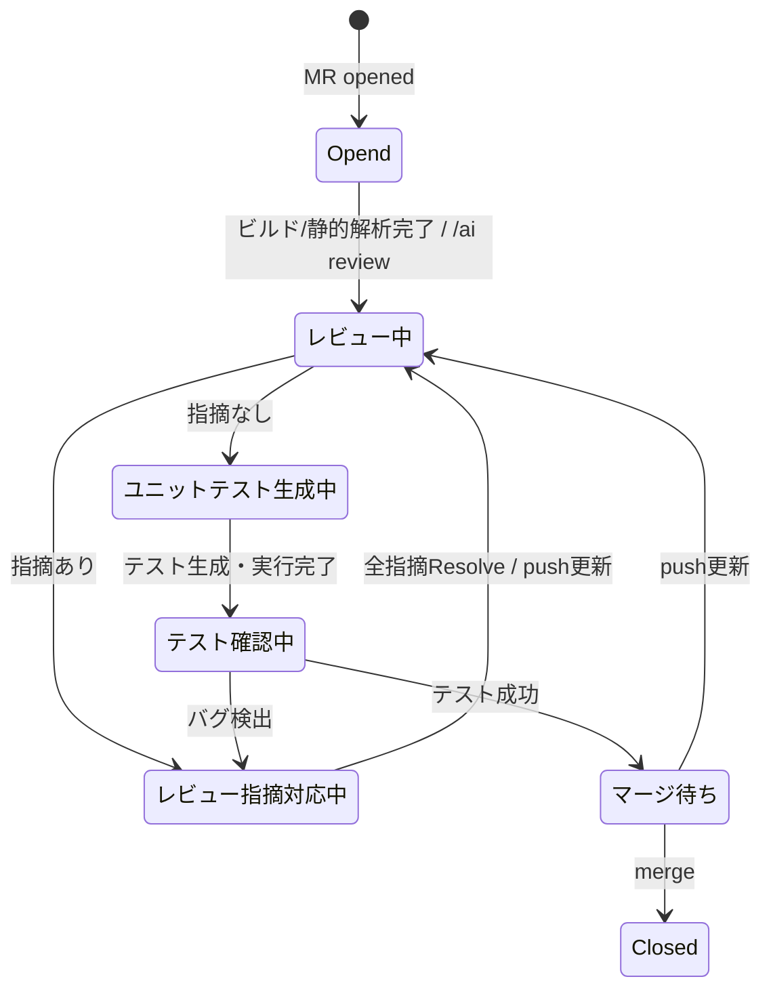

# MR状態設計 draft

複数MRを並行処理するため、状態はMR単位で保持する。

## 状態一覧

| 区分 | 状態 | 定義 |
| --- | --- | --- |
| 開始 | Opend | MR作成直後。ビルド/静的解析および初回レビュー待ち。ビルド/静的解析エラー時も維持 |
| レビュー | レビュー中 | AIレビューまたは再レビュー実行中 |
| レビュー | レビュー指摘対応中 | AI/人間レビュー指摘への対応待ち |
| テスト | ユニットテスト生成中 | 指摘解消後、ユニットテスト生成・実行中 |
| テスト | テスト確認中 | 生成テスト結果やカバレッジ確認待ち |
| 完了前 | マージ待ち | レビュー・テスト完了後、マージ可能 |
| 終了 | Closed | MRがマージまたはクローズ済み |

エージェント呼び出し失敗はMR状態ではなく処理イベントとして扱う。失敗時はMR状態を遷移させずに1回リトライし、2回目も失敗した場合は異常系として通知・運用対応に回す。

## 状態遷移

MRがcloseされた場合は、現在状態に関わらずClosedへ遷移する。
ビルドエラー時はOpendのままエージェントがビルドエラーのみの修正提案を行う。
静的解析エラー時はOpendのままMRコメントでユーザーへ通知する。
テスト実行失敗時はテスト確認中のまま1回リトライし、再失敗時はMRコメントで通知する。
カバレッジ未達時はテスト確認中のままMRコメントで結果を通知する。

