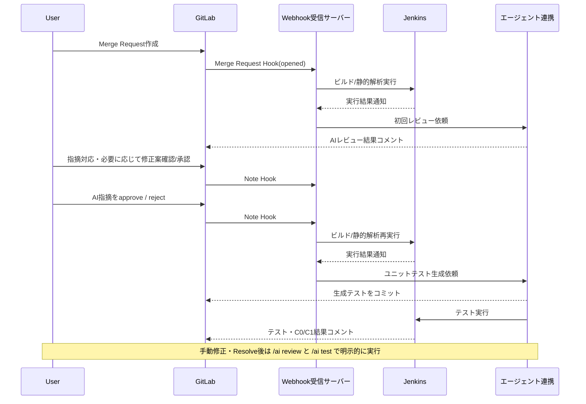

# 全体フロー

詳細はユースケース別の詳細フローを参照する。

```mermaid
sequenceDiagram
    participant User
    participant GitLab
    participant Webhook as Webhook受信サーバー
    participant Jenkins
    participant Agent as エージェント連携

    User->>GitLab: Merge Request作成
    GitLab->>Webhook: Merge Request Hook(opened)
    Webhook->>Jenkins: ビルド/静的解析実行
    Jenkins-->>Webhook: 実行結果通知
    Webhook->>Agent: 初回レビュー依頼
    Agent-->>GitLab: AIレビュー結果コメント

    User->>GitLab: 指摘対応・必要に応じて修正案確認/承認
    GitLab->>Webhook: Note Hook

    User->>GitLab: AI指摘をapprove / reject
    GitLab->>Webhook: Note Hook
    Webhook->>Jenkins: ビルド/静的解析再実行
    Jenkins-->>Webhook: 実行結果通知
    Webhook->>Agent: ユニットテスト生成依頼
    Agent-->>GitLab: 生成テストをコミット
    Agent->>Jenkins: テスト実行
    Jenkins-->>GitLab: テスト・C0/C1結果コメント

    Note over User,Agent: 手動修正・Resolve後は /ai review と /ai test で明示的に実行
```
