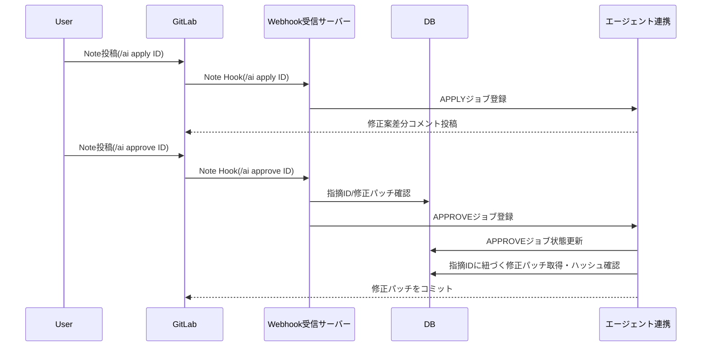

# 詳細フロー: 修正案確認・承認

```mermaid
sequenceDiagram
    participant User
    participant GitLab
    participant Webhook as Webhook受信サーバー
    participant DB as DB
    participant Agent as エージェント連携

    User->>GitLab: Note投稿(/ai apply ID)
    GitLab->>Webhook: Note Hook(/ai apply ID)
    Webhook->>Agent: APPLYジョブ登録
    Agent-->>GitLab: 修正案差分コメント投稿

    User->>GitLab: Note投稿(/ai approve ID)
    GitLab->>Webhook: Note Hook(/ai approve ID)
    Webhook->>DB: 指摘ID/修正パッチ確認
    Webhook->>Agent: APPROVEジョブ登録
    Agent->>DB: APPROVEジョブ状態更新
    Agent->>DB: 指摘IDに紐づく修正パッチ取得・ハッシュ確認
    Agent-->>GitLab: 修正パッチをコミット
```
