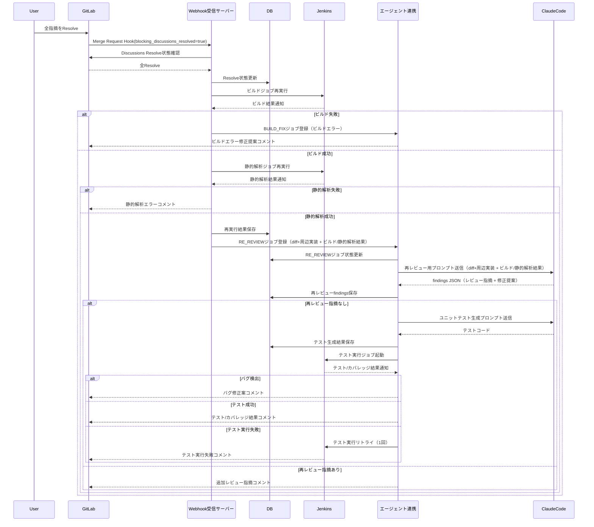

# 詳細フロー: 再レビュー・テスト

```mermaid
sequenceDiagram
    participant User
    participant GitLab
    participant Webhook as Webhook受信サーバー
    participant DB as DB
    participant Jenkins
    participant Agent as エージェント連携
    participant Claude as ClaudeCode

    User->>GitLab: 全指摘をResolve
    GitLab->>Webhook: Merge Request Hook(blocking_discussions_resolved=true)
    Webhook->>GitLab: Discussions Resolve状態確認
    GitLab-->>Webhook: 全Resolve
    Webhook->>DB: Resolve状態更新
    Webhook->>Jenkins: ビルドジョブ再実行
    Jenkins-->>Webhook: ビルド結果通知
    alt ビルド失敗
        Webhook->>Agent: BUILD_FIXジョブ登録（ビルドエラー）
        Agent-->>GitLab: ビルドエラー修正提案コメント
    else ビルド成功
        Webhook->>Jenkins: 静的解析ジョブ再実行
        Jenkins-->>Webhook: 静的解析結果通知
        alt 静的解析失敗
            Webhook-->>GitLab: 静的解析エラーコメント
        else 静的解析成功
            Webhook->>DB: 再実行結果保存
            Webhook->>Agent: RE_REVIEWジョブ登録（diff+周辺実装 + ビルド/静的解析結果）
            Agent->>DB: RE_REVIEWジョブ状態更新
            Agent->>Claude: 再レビュー用プロンプト送信（diff+周辺実装 + ビルド/静的解析結果）
            Claude-->>Agent: findings JSON（レビュー指摘 + 修正提案）
            Agent->>DB: 再レビューfindings保存

            alt 再レビュー指摘なし
                Agent->>Claude: ユニットテスト生成プロンプト送信
                Claude-->>Agent: テストコード
                Agent->>DB: テスト生成結果保存
                Agent->>Jenkins: テスト実行ジョブ起動
                Jenkins-->>Agent: テスト/カバレッジ結果通知
                alt バグ検出
                    Agent-->>GitLab: バグ修正案コメント
                else テスト成功
                    Agent-->>GitLab: テスト/カバレッジ結果コメント
                else テスト実行失敗
                    Agent->>Jenkins: テスト実行リトライ（1回）
                    Jenkins-->>GitLab: テスト実行失敗コメント
                end
            else 再レビュー指摘あり
                Agent-->>GitLab: 追加レビュー指摘コメント
            end
        end
    end
```
