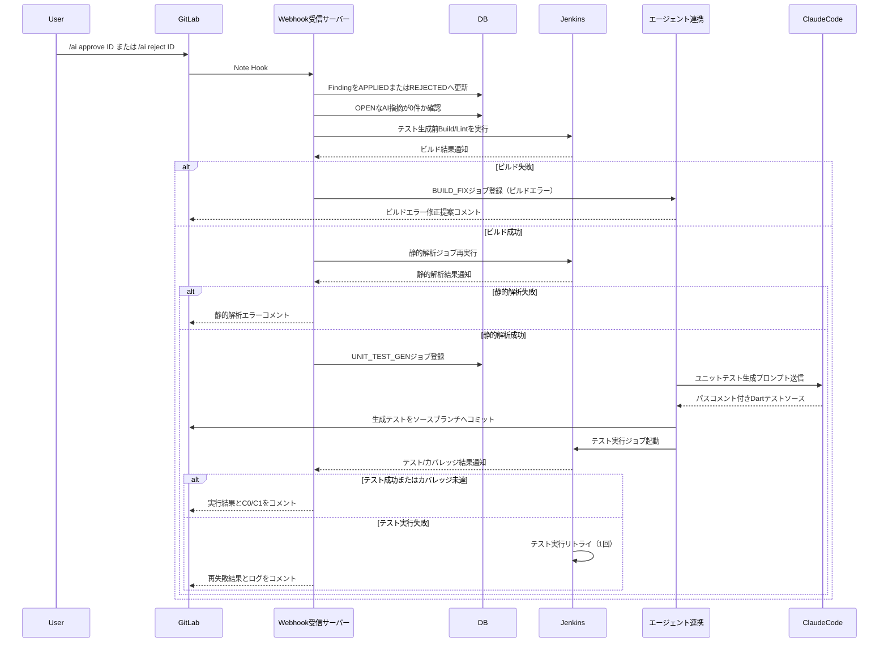

# 詳細フロー: 指摘対応後のテスト生成

以下は現行デモで成立している経路を示す。全Discussion Resolveを起点とする自動再レビューは、GitLab.comの実Webhookに`blocking_discussions_resolved`が含まれなかったため、実用化TODOとして本図から分離する。

手動修正またはDiscussion Resolve後は、利用者が`/ai review`で確認し、問題がなければ`/ai test`で上図のテスト生成処理を開始する。将来はDiscussion APIによる全Resolve再確認、Build/Lint、`RE_REVIEW`を接続し、再レビュー指摘が0件の場合だけ`UNIT_TEST_GEN`へ進める。
