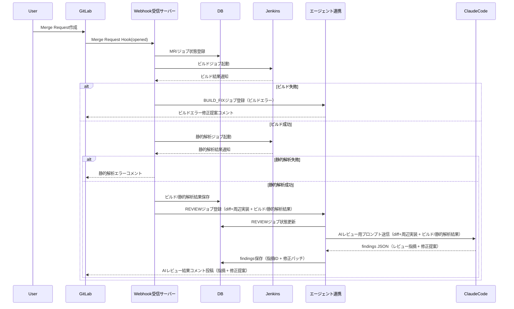

# 詳細フロー: 初回レビュー

```mermaid
sequenceDiagram
    participant User
    participant GitLab
    participant Webhook as Webhook受信サーバー
    participant DB as DB
    participant Jenkins
    participant Agent as エージェント連携
    participant Claude as ClaudeCode

    User->>GitLab: Merge Request作成
    GitLab->>Webhook: Merge Request Hook(opened)
    Webhook->>DB: MR/ジョブ状態登録
    Webhook->>Jenkins: ビルドジョブ起動
    Jenkins-->>Webhook: ビルド結果通知
    alt ビルド失敗
        Webhook->>Agent: BUILD_FIXジョブ登録（ビルドエラー）
        Agent-->>GitLab: ビルドエラー修正提案コメント
    else ビルド成功
        Webhook->>Jenkins: 静的解析ジョブ起動
        Jenkins-->>Webhook: 静的解析結果通知
        alt 静的解析失敗
            Webhook-->>GitLab: 静的解析エラーコメント
        else 静的解析成功
            Webhook->>DB: ビルド/静的解析結果保存
            Webhook->>Agent: REVIEWジョブ登録（diff+周辺実装 + ビルド/静的解析結果）
            Agent->>DB: REVIEWジョブ状態更新
            Agent->>Claude: AIレビュー用プロンプト送信（diff+周辺実装 + ビルド/静的解析結果）
            Claude-->>Agent: findings JSON（レビュー指摘 + 修正提案）
            Agent->>DB: findings保存（指摘ID + 修正パッチ）
            Agent-->>GitLab: AIレビュー結果コメント投稿（指摘 + 修正提案）
        end
    end
```
