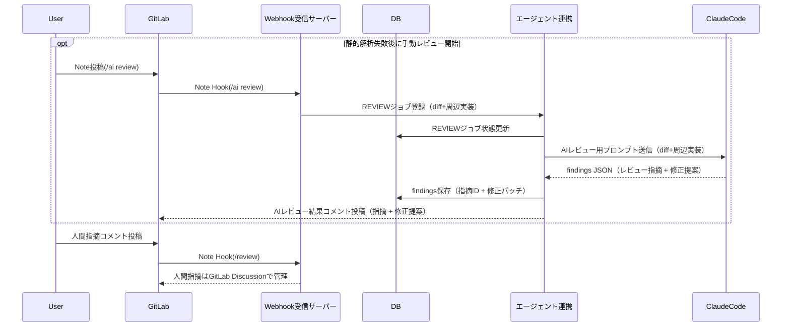

# 詳細フロー: 手動レビュー

```mermaid
sequenceDiagram
    participant User
    participant GitLab
    participant Webhook as Webhook受信サーバー
    participant DB as DB
    participant Agent as エージェント連携
    participant Claude as ClaudeCode

    opt 静的解析失敗後に手動レビュー開始
        User->>GitLab: Note投稿(/ai review)
        GitLab->>Webhook: Note Hook(/ai review)
        Webhook->>Agent: REVIEWジョブ登録（diff+周辺実装）
        Agent->>DB: REVIEWジョブ状態更新
        Agent->>Claude: AIレビュー用プロンプト送信（diff+周辺実装）
        Claude-->>Agent: findings JSON（レビュー指摘 + 修正提案）
        Agent->>DB: findings保存（指摘ID + 修正パッチ）
        Agent-->>GitLab: AIレビュー結果コメント投稿（指摘 + 修正提案）
    end

    User->>GitLab: 人間指摘コメント投稿
    GitLab->>Webhook: Note Hook(/review)
    Webhook-->>GitLab: 人間指摘はGitLab Discussionで管理
```
