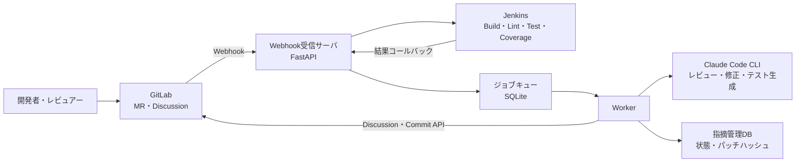

# MRを作成したらAIがレビューと単体テスト作成を自動で支援してくれるシステム

## 1. 概要

本企画では、GitLab・Jenkins・CLIエージェントを連携し、マージリクエスト（MR）作成時における**コードレビュー・修正・ユニットテスト生成・検証**をAIが支援するシステムを提案する。

レビュアーは本来の判断業務に集中し、レビュイーは指摘への対応をAIと共に進めることで、
**双方の負担を軽減しながら、レビュー → 修正 → テスト の品質向上サイクルを効率化する**ことを目的とする。

---

## 2. コンセプト

* 差分理解型AIによる品質向上
* 人間とAIの協調（完全自動ではなく半自動）
* 既存CI/CDフローへの自然な統合
* **多様なプロジェクトへの展開可能な設計**（言語・FW非依存のコア + アダプタ方式）

**キーメッセージ：**

> レビュアーの指摘負担を減らし、レビュイーの修正コストも下げる。AIが双方の橋渡しをする。

### ■なぜAIを使うのか

AIがコードレビューやユニットテスト生成で効果を発揮することは、本企画の前提とする。一方、個人がそれぞれAIを利用するだけでは、利用者が作成するプロンプトの質や与える情報によって、レビュー観点、指摘の粒度、生成テストの品質に差が生じる。

本システムでAIをCI/CDへ組み込む目的は、AIを使う行為そのものを自動化することではなく、**チームで合意した共通プロンプトと実行条件を継続的に使用できる仕組みを作ること**である。プロンプト、入力コンテキスト、出力形式、実行タイミングをシステム側で統一することで、個人のプロンプト作成能力への依存を減らし、チームとして一定の観点と粒度でAIを活用できる。

また、AIの指摘、修正案、承認操作、生成テスト、実行結果をGitLabのMRへ集約する。これにより、各利用者とAIの間だけで完結しがちなやり取りを、チームが確認・追跡できるレビュー記録として残す。

本企画におけるAI活用の目的は次の3点である。

* **属人化の低減**：チーム共通のプロンプトとレビュー観点を使用し、利用者による品質のばらつきを抑える
* **レビュー過程の記録**：AIの指摘、修正案、人間の承認、テスト結果をMR上に残し、判断過程を追跡可能にする
* **工数の削減**：利用者ごとのプロンプト作成、AIへの情報入力、結果の転記、テスト雛形作成にかかる作業を減らす

AI出力には誤りや揺らぎがあるため、AIを最終判断者にはしない。修正コミット前の人間承認、JSONスキーマ検証、不正出力時の再試行、JenkinsによるBuild/Testを組み合わせ、共通化による効率と人間による品質判断を両立する。

---

## 3. システム構成

### ■構成要素

* GitLab：MR管理、Webhook発火
* Jenkins：ビルド・静的解析・単体テスト実行
* CLIエージェント（Claude系）：レビュー・修正・ユニットテスト生成
* Webhook受信サーバ：イベントトリガー
* **プロジェクトアダプタ**：言語・FW固有の設定（ビルド・テストコマンド・カバレッジ形式等）・スキルファイル・ポリシーをパッケージ化

### ■最小構成

1台のサーバで以下を実行可能：

* Jenkins
* Webhook受信サーバ
* CLIエージェント
* Git操作環境

### ■システム全体構成図



---

## 4. 処理フロー

### ■全体フロー

1. MR作成
2. Jenkinsによるビルド・静的解析
3. ビルド・静的解析結果を踏まえたAIレビュー実行
4. 第三者による人間レビュー
5. 修正フェーズ（Apply or 手動修正）
6. AI指摘への対応完了（承認適用または却下）
7. JenkinsによるBuild・静的解析の再実行
8. ユニットテスト生成（現行デモでは再レビューを省略）
9. Jenkinsでテスト実行
10. 結果をMRへフィードバック

---

### ■詳細フロー

#### ① ビルド

* コンパイル・Lint
* ビルド失敗時は静的解析をskipし、ビルドエラーのみを対象にエージェントが修正提案する
* 静的解析失敗時はMR状態をOpendのまま維持し、レビューを行わない
* 静的解析失敗後はコメントコマンドによりレビュー開始可能
* リトライ回数は全体で1回までとする

#### ② AIレビュー

* 差分解析による指摘生成
* 修正提案（before/after付き）
* 指摘ごとにIDを付与

#### ③ 人間レビュー

* 人間レビュアーがAI指摘を確認
* 追加指摘をMRに投稿
* レビュー確認後、レビュイーが修正フェーズに進む

#### ④ 修正フェーズ

* `/ai apply <ID>` により修正案を生成し、MRコメントに差分を提示
* 開発者が内容を確認し、`/ai approve <ID>` で適用を承認
* 承認後、AIがブランチへ変更をコミット
* または開発者が手動修正（承認不要）

#### ⑤ AI指摘への対応完了

* AI指摘は`/ai approve <ID>`による修正適用、または`/ai reject <ID>`による却下で対応済みとする
* DB上のOPENなAI指摘が0件になると、対象コミットのBuild・静的解析を再実行する
* Build・静的解析が成功すると、現行デモでは再レビューを省略してユニットテスト生成へ進む

#### ⑥ 手動修正・Discussion Resolve時の確認

* GitLab.comの実Webhookでは、最後のDiscussion Resolve時に自動判定に必要な`blocking_discussions_resolved`が届かない場合がある
* 手動修正またはDiscussion Resolve後は、必要に応じて`/ai review`で修正後コードを確認する
* 確認後、`/ai test`でユニットテスト生成を開始する
* 全Resolveの確実な検知と自動再レビューは実用化に向けた改善項目とする

#### ⑦ ユニットテスト生成

* 現行デモの自動経路では、全AI指摘の承認適用または却下後、Build・静的解析が成功した時点で実行
* 手動修正・Discussion Resolve経路では、確認後に`/ai test`で実行
* 修正内容に基づくユニットテスト生成

#### ⑨ テスト実行・カバレッジ確認

* Jenkinsジョブとして実行（`flutter test --coverage --branch-coverage`）
* LCOVから C0（ステートメント）/ C1（分岐）カバレッジを計算
* テスト実行失敗時は1回リトライする
* テスト失敗時は結果とログをMRへ投稿し、人間が製品バグか実行・生成上の問題かを判断する
* カバレッジ目標未達の場合、自動ループは行わず結果をMRへフィードバック

---

## 5. 指摘管理モデル

各指摘は以下の状態を持つ：

* OPEN：AI指摘生成済み、対応待ち
* APPLIED：承認を経てAIによる修正適用済
* REJECTED：対応不要と判断

`/ai apply <ID>`は保存済み修正パッチを提示する操作であり、DB状態はOPENのまま維持する。

> **状態遷移：** OPEN → APPLIED / REJECTED
> **全AI指摘対応後：** Build・静的解析 → ユニットテスト生成

### ■ユニットテスト生成条件

* DB上のOPENなAI指摘が0件となり、Build・静的解析が成功した場合に自動実行
* 手動修正・Discussion Resolveの場合は`/ai review`で確認後、`/ai test`で手動実行
* REJECTは許容

---

## 6. UI設計

GitLab標準機能を活用し、コメントベースで操作：

```
# --- 開発者・レビュアー操作 ---
[GitLab DiscussionのResolve] # 手動修正への対応完了をGitLab上で記録

# --- 開発者操作 ---
/ai apply R1      # 修正案を生成・提示（即時適用はしない）
/ai approve R1    # 提示された修正案を承認・適用
/ai reject R2     # 指摘を対応不要と判断
/ai test          # ユニットテスト生成を手動トリガー
```

> **注1：** 修正フェーズはOPEN状態の指摘に対して操作可能。  
> **注2：** ユニットテスト生成・適用は承認不要。生成後、自動でコミットされる。  
> **注3：** MRの最終マージは従来通りGitLabのApproveが必要。
> **注4：** 手動Resolve後の自動再レビューは現行デモの対象外。`/ai review`と`/ai test`で明示的に実行する。

### ■特徴

* 追加UI不要
* 実装容易
* GitLabネイティブ操作に近い体験

---

## 7. ユニットテスト生成戦略

### ■生成タイミング

* 全AI指摘への対応後、Build・静的解析が成功した時点でユニットテストを生成し、Jenkinsジョブでテスト実行・カバレッジ計測を行う
* 手動修正後は`/ai test`で同じ生成・実行処理を開始できる
* カバレッジ目標未達時の追加生成ループは自動実行しない

### ■カバレッジ目標（ユーザー設定可能）

| 種別 | 内容 | デフォルト |
|---|---|---|
| C0 | ステートメントカバレッジ | 80% |
| C1 | 分岐カバレッジ | 70% |

目標値は環境変数（`.env`）でデフォルトを設定し、Jenkinsジョブパラメータで実行毎に上書きできる。

### ■生成内容

#### ① バグ再現テスト

* 修正前に失敗するケース
* 再発防止目的

#### ② 正常・境界テスト

* 分岐網羅
* エッジケース検証

---

## 8. 既存テストとの連携

### ■基本方針

既存テストを活かし、AIは補完に徹する

### ■処理

1. 既存テスト実行（`flutter test --coverage --branch-coverage`）
2. LCOVから C0 / C1 カバレッジを計算
3. テスト実行失敗時は1回リトライ
4. 再失敗時はテスト結果とログをMRへ投稿する
5. カバレッジ目標未達時は差分未カバー箇所を抽出
6. テスト結果・カバレッジ結果をMRへ投稿

---

## 9. Jenkinsの役割

* ビルド実行
* テスト実行・カバレッジ計測
* CI基盤としての再現性確保

### ■位置付け

AI：判断・生成  
Jenkins：実行（テスト・カバレッジ計測）

---

## 10. 自律性設計

### ■方針

完全自動ではなく「条件付き自動」

### ■自動トリガー

* MR作成 → ビルド確認、静的解析成功時にAIレビュー実行
* `/ai apply` 実行 → 修正案提示（承認待ちに遷移）
* `/ai approve` 実行 → ブランチへ適用
* 全AI指摘を`approve`または`reject` → Build・静的解析 → ユニットテスト生成・自動コミット

### ■手動トリガー

```
/ai test
/ai review
```

---

## 11. エージェント選定

### ■採用

Claude系エージェント

### ■理由

* 差分理解能力
* 複数ファイル修正
* ユニットテスト生成能力
* 自律的処理に適している

---

## 12. 期待効果

* レビュー工数削減
* 品質の均一化
* バグ再発防止
* 属人性の低減
* **AI活用度の統一**：共通システムを通じてAIの活用度合いを正規化することで、使用者によるレビュー精度のバラツきを解消し、レビュー品質と粒度をチーム全体で揃える

---

## 13. 成功の定義

現行デモは、次の状態をすべて証跡で確認できた場合に成功とする。

1. 利用者が個別にプロンプトを作成せず、バージョン管理された共通プロンプトでAIレビューとユニットテスト生成を実行できる
2. MRを起点にBuild・静的解析とAIレビューが実行され、AIの指摘と後続操作がGitLab上の記録として残る
3. `/ai apply`ではブランチを変更せず、開発者の`/ai approve`後に限って対象パッチがコミットされる
4. 全AI指摘への対応後に生成テストがソースブランチへコミットされ、JenkinsでテストとC0/C1カバレッジが実行される
5. WebhookおよびJenkinsコールバックの不正トークンが拒否され、AI/CLI失敗後もジョブキューが解放される
6. リポジトリの自動テストが全件成功し、実行コミット・条件・結果が検証レポートに記録される

AI指摘の再現率・適合率、修正正解率、生成テスト有効率の目標値は[評価設計書](評価設計書.md)で定義する。これらの統計評価と、全Discussion Resolve後の自動再レビューは実用化判定の対象とし、現行デモの成功条件とは分けて扱う。

---

## 14. まとめ

本システムは、

* レビュー自動化に留まらず
* 修正提案・適用・検証までを統合し
* 既存CI/CDに組み込むことで

**実務で活用可能なAI開発支援基盤を実現する**
