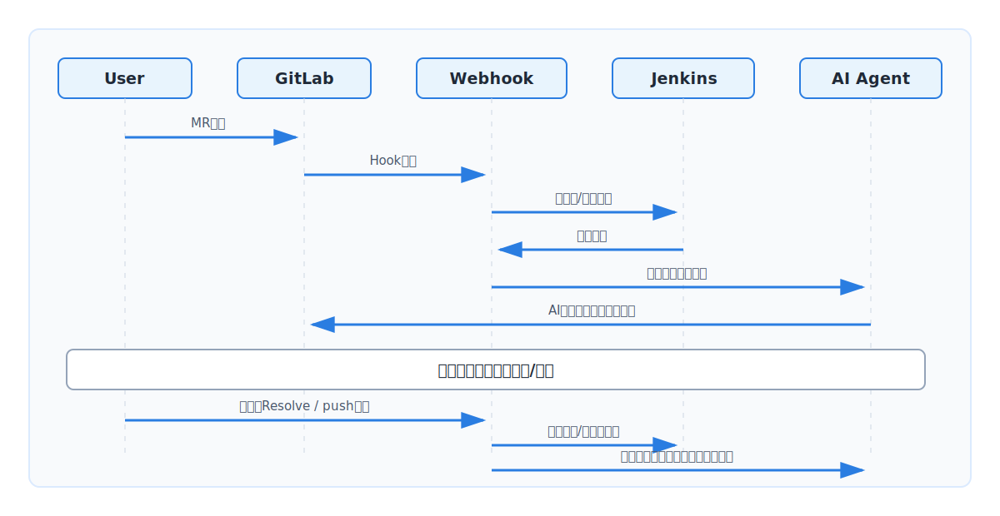
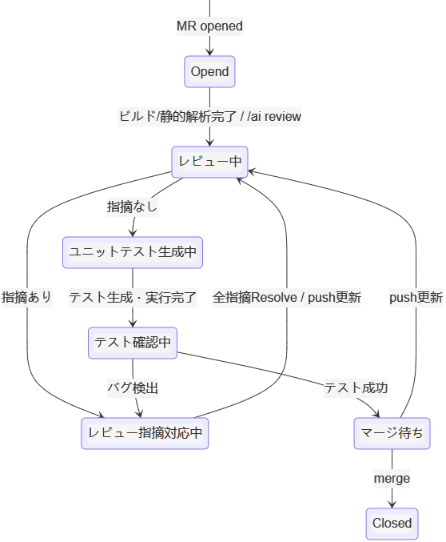

# AIエージェントによるコードレビュー・テスト自動化システム

##### メンバー

植田祐伍(リーダー)

ChatGPT(企画補助・設計)
Codex(ドキュメント作成・実装)
Claude Code(テスター)

---

## どんなシステム？

対象は、**品質は担保したいが、レビューやユニットテストに十分な工数を割けないプロジェクト**。

- レビュー担当者が少ない
- 納期が近く、確認作業が後回しになりがち
- テストを書きたいが、変更のたびに手が回らない

このシステムは、MR(マージリクエスト)が作成されたタイミングでAIが先に差分を読み、  レビュー・修正案・ユニットテスト生成までを支援する。

<div class="highlight">

レビュー・テストの工数を増やさずに、品質向上を狙える仕組み。

</div>

---

## 1. 概要

GitLab・Jenkins・CLIエージェントを連携し、
MR作成時のコードレビュー・修正・ユニットテスト生成・検証を**AIが支援するシステム**。

<div class="highlight">

**解決する課題：**

レビュアーの指摘作業コスト ／ レビュイーの修正・対応コスト  
→ AIが下準備を担当し、**工数を増やさず品質向上サイクルを強化**

</div>

---

## 2. コンセプト

| 軸 | 内容 |
|---|---|
| 差分理解型AI | コードの変更点を深く理解したレビュー |
| 人間とAIの協調 | 完全自動ではなく**半自動**で安全性を確保 |
| 既存CI/CDへの統合 | フローを壊さず自然に組み込む |

---

## 3. システム構成

```
MR作成（GitLab）
    │
    ▼
Webhook受信サーバ
    │
    ├─► Jenkins（ビルド・静的解析・テスト実行）
    ├─► DB（MR状態・ジョブ・findings管理）
    │
    └─► CLIエージェント
            ├── ビルドエラー修正提案
            ├── コードレビュー
            ├── 修正案提示・承認後適用
            └── ユニットテスト生成
```

**最小構成：** 1台のサーバで全コンポーネントを実行可能

---

## 4. 処理フロー（全体）



---

## 5. MR状態遷移



ビルド/静的解析/テスト実行エラーは状態を無理に進めず、MRコメントで通知する。

---

## 6. 指摘・操作モデル

| 操作 | 役割 |
|---|---|
| GitLab Discussion Resolve | 指摘対応完了の合図 |
| `/ai review` | 静的解析失敗後などに手動レビュー開始 |
| `/ai apply ID` | AI修正案の差分提示 |
| `/ai approve ID` | 承認済み修正パッチをコミット |

> 全指摘Resolve後、ビルド/静的解析を再実行し、再レビューとユニットテスト生成へ進む。

---

## 7. UI設計（GitLabコメントベース）

追加UIなし。GitLabのコメント機能のみで操作完結。

```bash
# 開発者・レビュアー操作
[GitLab Discussion Resolve]  # 指摘への対応完了の合図
                             # 全Resolve後、再レビュー→ユニットテスト生成が自動起動

# 開発者操作
/ai review      # 手動レビュー開始
/ai apply R1    # 修正案を生成・提示
/ai approve R1  # 修正案を承認・適用
```

---

## 8. ユニットテスト生成戦略

### 生成タイミング
全指摘Resolve後の再レビューで指摘なしと判定された時点

### 生成内容

| 軸 | 生成対象 | 目的 |
|---|---|---|
| 差分テスト補完 | 追加・変更された実装に対する正常系、異常系、境界値テスト | 新規実装の品質担保 |
| 不足テスト補完 | 既存テストやカバレッジから不足しているテスト | テスト抜けの削減 |

### 既存テストとの連携
既存テスト・カバレッジ・MR差分を確認し、必要なテストだけをAIが補完

---

## 9. 自律性設計

### 自動トリガー
- MR作成 → ビルド/静的解析 → AIレビュー実行
- 全指摘Resolve → ビルド/静的解析再実行 → 再レビュー → ユニットテスト生成
- `/ai approve` → ブランチ適用

### 人間が関与するゲート
- **人間レビュー**：AI指摘の確認
- **修正承認**：`/ai approve` による明示的承認
- **最終マージ**：GitLab の通常Approveフロー

---

## 10. 期待効果

| 効果 | 内容 | 効果期待度 |
|---|---|---|
| **AI活用度の統一** | 共通システムを通じてAIの活用度合いを正規化。使用者ごとのレビュー精度のバラツきを解消し、チーム全体で品質・粒度を揃える | ★★★ |
| ユニットテスト補完 | 差分テスト・不足テストをAIが生成し、テスト作成工数を抑えつつ検証範囲を拡大 | ★★★ |
| レビュー工数削減 | AIによる一次レビューの自動化 | ★★ |
| 品質の均一化 | レビュー基準とユニットテスト観点の標準化 | ★★ |
| 属人性の低減 | レビュアー依存の排除 | ★ |

---

## まとめ

<div class="highlight">

**レビュアー**は判断業務に集中できる  
**レビュイー**はAIと共に修正を進められる  
→ 双方の負担を下げながら、品質向上サイクルを回し続ける

</div>

- GitLab ネイティブな操作感で導入障壁を低減
- 人間の判断を残しつつ、繰り返し作業をAIが担う
- 1台構成から始められるスモールスタート設計
