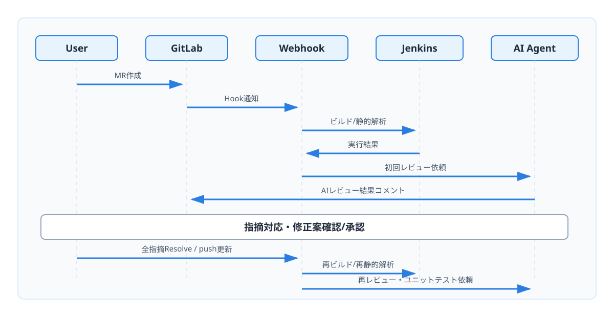
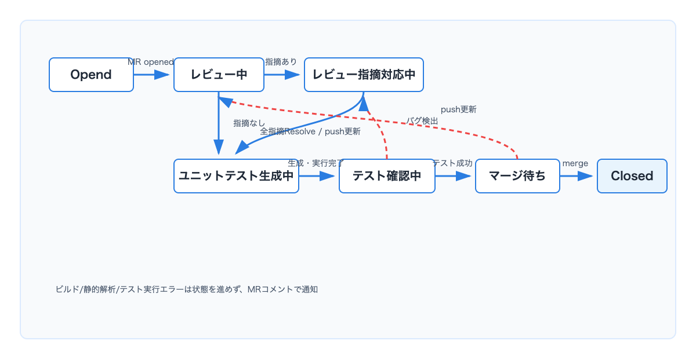

# MR作成だけでAIレビューとユニットテスト生成を自動で行うシステム

##### メンバー

植田祐伍(リーダー)

ChatGPT(企画補助・設計)
Codex(ドキュメント作成・実装)
Claude Code(テスター)

---

## 使用方法

1. GitLabでMR（マージリクエスト）を作成する
2. AIがMRの差分をレビューし、指摘・修正案をGitLabコメントへ投稿する
3. 指摘対応後、AIがユニットテストを生成し、Jenkinsで検証する



---

## 1. 導入メリット

本システムは、個人任せになりがちなAI活用を、**チームで再現性高く運用するための仕組み**である。

| メリット | 内容 |
|---|---|
| AI活用をチーム標準に | MR作成を起点に共通のAIレビュー・テスト生成フローを実行できる |
| レビューを議事録として蓄積 | AIの指摘・修正案・対応状況がMR上に残り、意思決定を後から確認できる |
| プロンプト品質を標準化 | 個人ごとのプロンプト作成スキルに左右されず、一定品質のAIレビューを実現する |
| 属人化を軽減 | AIを使いこなせる担当者へ依存せず、チーム全員が同じ手順で活用できる |
| CI/CDへの統合 | 既存のMR・ビルド・テストの流れでAIが自動実行され、追加操作なく品質確認を標準化できる |

<div class="highlight">

**個人のAIスキルを、チーム全体で使える開発プロセスへ。**

</div>

---

## 2. コンセプト

| 軸                | 内容                                           |
| ----------------- | ---------------------------------------------- |
| 差分理解型AI      | コードの変更点を深く理解したレビュー           |
| 人間とAIの協調    | 完全自動ではなく**半自動**で安全性を確保 |
| 既存CI/CDへの統合 | フローを壊さず自然に組み込む                   |

---

## 3. システム構成

```
MR作成（GitLab）
    │
    ▼
Webhook受信サーバ
    │
    ├─► Jenkins（ビルド・静的解析・テスト実行）
    ├─► DB（MR状態・ジョブ・findings管理）
    │
    └─► CLIエージェント
            ├── ビルドエラー修正提案
            ├── コードレビュー
            ├── 修正案提示・承認後適用
            └── ユニットテスト生成
```

**最小構成：** 1台のサーバで全コンポーネントを実行可能

---

## 4. MR状態遷移



ビルド/静的解析/テスト実行エラーは状態を無理に進めず、MRコメントで通知する。

---

## 5. 指摘・操作モデル

| 操作                      | 役割                                 |
| ------------------------- | ------------------------------------ |
| GitLab Discussion Resolve | 指摘対応完了の合図                   |
| `/ai review`            | 静的解析失敗後などに手動レビュー開始 |
| `/ai apply ID`          | AI修正案の差分提示                   |
| `/ai approve ID`        | 承認済み修正パッチをコミット         |

> 全指摘Resolve後、ビルド/静的解析を再実行し、再レビューとユニットテスト生成へ進む。

---

## 6. UI設計（GitLabコメントベース）

追加UIなし。GitLabのコメント機能のみで操作完結。

```bash
# 開発者・レビュアー操作
[GitLab Discussion Resolve]  # 指摘への対応完了の合図
                             # 全Resolve後、再レビュー→ユニットテスト生成が自動起動

# 開発者操作
/ai review      # 手動レビュー開始
/ai apply R1    # 修正案を生成・提示
/ai approve R1  # 修正案を承認・適用
```

---

## 7. ユニットテスト生成戦略

### 生成タイミング

全指摘Resolve後の再レビューで指摘なしと判定された時点

### 生成内容

| 軸             | 生成対象                                                 | 目的               |
| -------------- | -------------------------------------------------------- | ------------------ |
| 差分テスト補完 | 追加・変更された実装に対する正常系、異常系、境界値テスト | 新規実装の品質担保 |
| 不足テスト補完 | 既存テストやカバレッジから不足しているテスト             | テスト抜けの削減   |

### 既存テストとの連携

既存テスト・カバレッジ・MR差分を確認し、必要なテストだけをAIが補完

---

## 8. 自律性設計

### 自動トリガー

- MR作成 → ビルド/静的解析 → AIレビュー実行
- 全指摘Resolve → ビルド/静的解析再実行 → 再レビュー → ユニットテスト生成
- `/ai approve` → ブランチ適用

### 人間が関与するゲート

- **人間レビュー**：AI指摘の確認
- **修正承認**：`/ai approve` による明示的承認
- **最終マージ**：GitLab の通常Approveフロー

---

## まとめ

<div class="highlight">

**レビュアー**は判断業務に集中できる
**レビュイー**はAIと共に修正を進められる
→ 双方の負担を下げながら、品質向上サイクルを回し続ける

</div>

- GitLab ネイティブな操作感で導入障壁を低減
- 人間の判断を残しつつ、繰り返し作業をAIが担う
- 1台構成から始められるスモールスタート設計
