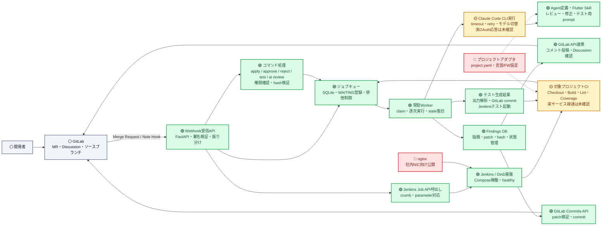
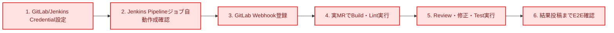

# AI Review Jenkins 進捗・コンポーネント関係図

**確認日:** 2026-08-15
**判定基準:** 実装ファイル、Docker Compose の稼働状態、テスト結果、`Plan/全体アクションアイテム.md` を照合

## 凡例

- 🟢 **完了:** 主要機能が実装済みで、現在の構成で利用または検証できる
- 🟡 **一部実装:** 基本実装はあるが、実サービス接続または後続処理が未完成
- 🔴 **未実装:** 設計のみ、スタブのみ、または主要な接続がない
- ⚪ **外部:** このリポジトリの実装対象外の外部システム

## コンポーネント関係図

SVG版は2026-07-29時点のスナップショット: [進捗・コンポーネント関係図](images/進捗_コンポーネント関係図.svg)

## 現在の到達点

| 領域 | 状態 | 確認できた内容 | 残作業 |
|---|---|---|---|
| DB・ジョブキュー | 🟢 完了 | `findings` / `job_queue`、Alembic、排他制御、stale復旧 | 運用監視・利用量カラムは将来対応 |
| Webhook受信 | 🟢 完了 | FastAPI、healthcheck、GitLabトークン検証、イベント振り分け、Jenkins起動 | 実GitLab/JenkinsによるE2E確認 |
| コマンド処理 | 🟢 完了 | `/ai apply`、`approve`、`reject`、`test`、`review`、Developer権限確認 | `/review`は設計どおりGitLab Discussion管理 |
| Worker・CLI | 🟡 一部実装 | 常駐Worker、CLI起動、timeout、retry、イベント別モデル指定、失敗時MR通知 | 実OAuth応答によるE2E確認 |
| AI定義・プロンプト | 🟢 完了 | レビュー、修正確認、Flutterテスト生成用のAgent/Skill/Prompt | プロジェクトアダプタ化、トークン最適化 |
| GitLab連携 | 🟢 完了 | MRコメント、Discussion Resolve確認、Commits API、権限確認 | 実GitLab疎通確認 |
| Jenkins基盤 | 🟢 完了 | Jenkins、DinD、証明書、永続化、配布用イメージ | nginxによる社内公開 |
| 対象プロジェクトCI | 🟡 一部実装 | Build/LintとTest/CoverageのPipeline、ジョブ自動作成、結果コールバック | 実プロジェクト疎通確認 |
| テスト生成フロー | 🟢 完了 | 出力解析、GitLabへのテストcommit、Jenkins実行、結果投稿 | 実プロジェクト疎通確認 |
| プロジェクトアダプタ | 🔴 未実装 | 設計・計画のみ | `project.yaml`、設定注入、言語/FW別サンプル |

## 検証結果

- コンテナ環境で `Tests/` を実行し、**57件すべて成功**
- テストカバレッジは **72%**
- Alembicを空DBへ`head`まで適用し、`BUILD_FIX` / `APPLY`を含むキュー制約を確認
- 外部Credential未設定のため、実GitLab・Jenkins・Claude OAuthを通したE2E確認は未実施

## 完成までのクリティカルパス

コード上の経路は接続済みであり、残るクリティカルパスは外部CredentialとJenkinsジョブを設定した実環境E2E確認である。
