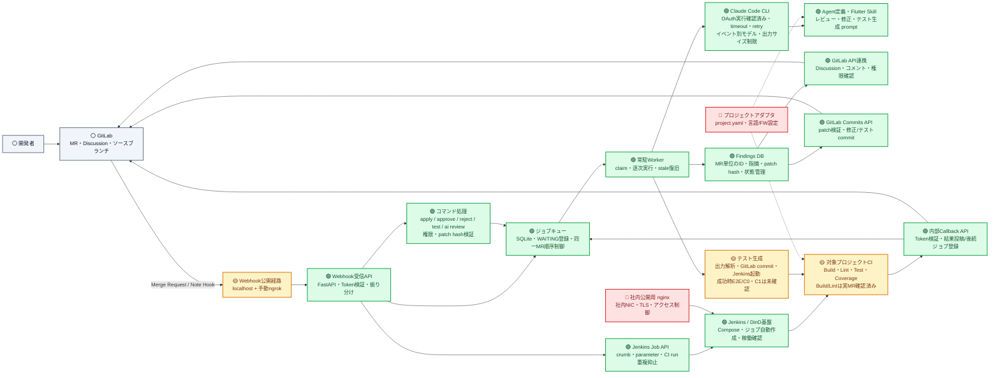
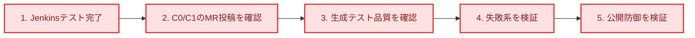

# AI Review Jenkins 進捗・コンポーネント関係図

**確認日:** 2026-08-19
**判定基準:** 実装ファイル、`Plan/全体アクションアイテム.md`、`Plan/TODO_Webhook以降_E2E.md`、直近コミットを照合

## 凡例

- 🟢 **完了:** 主要機能が実装済みで、現行構成で利用または実環境確認済み
- 🟡 **一部実装・確認中:** 基本経路は実装済みだが、E2Eの一部または運用・防御面が未確認
- 🔴 **未実装:** 設計のみ、スタブのみ、または主要な接続がない
- ⚪ **外部:** このリポジトリの実装対象外の外部システム

## コンポーネント関係図

SVG版は旧スナップショットのため、現時点ではこのMermaid図を正とする。

## 現在の到達点

| 領域 | 状態 | 確認できた内容 | 残作業 |
|---|---|---|---|
| DB・ジョブキュー | 🟢 完了 | `findings` / `job_queue`、Alembic、MR単位のFinding ID、排他制御、stale復旧 | 運用監視・トークン使用量カラムは将来対応 |
| Webhook・コマンド | 🟢 完了 | FastAPI、Token検証、MR/Note振り分け、`/ai` コマンド、Developer権限確認、Jenkins起動 | 外部公開時の入力制限・冪等性／リプレイ対策 |
| Worker・Claude Code CLI | 🟢 完了 | 常駐Worker、OAuthによる実レビュー、timeout、retry、イベント別モデル、失敗時MR通知 | 失敗系の実環境確認 |
| AI定義・プロンプト | 🟢 完了 | Flutter向けレビュー・修正・テスト生成、指摘の日本語化、Finding番号のMR単位採番 | プロジェクトアダプタ化、トークン最適化 |
| GitLab連携 | 🟢 完了 | MRコメント、差分行Discussion、Resolve確認、Commits API、修正コミットを実MRで確認 | 失敗系の実環境確認 |
| Jenkins基盤・Build/Lint | 🟢 完了 | Jenkins/DinD、Pipelineジョブ自動作成、Build/Lint成功、結果Callback、再レビュー起動を実MRで確認 | 運用監視 |
| テスト生成・Test/Coverage | 🟡 一部実装・確認中 | 解決後Build成功 → 再レビュー省略 → テスト生成 → テストcommit → Jenkinsテスト起動を実MRで確認 | テスト成功時のC0/C1投稿、生成品質の再確認 |
| Webhook公開・防御 | 🟡 一部実装・確認中 | localhost限定と手動ngrok起動手順、公開方針は文書化済み | Compose ngrok、Edge検証、本文サイズ・レート・project許可リスト、Webhook ID重複排除、HMAC/timestamp |
| プロジェクトアダプタ | 🔴 未実装 | 設計・計画のみ | `project.yaml`、設定注入、言語/FW別サンプル |
| 社内公開用 nginx | 🔴 未実装 | 設計のみ | 社内NIC向けTLS・アクセス制御 |

## 実環境E2Eの確認状況

2026-08-16時点で、実GitLab・Jenkins・Claude Codeを利用して次を確認済みです。

- MR !3で Build/Lint 成功からAIレビューの指摘保存・GitLab投稿まで完了。
- `/ai approve R1` で修正コミットを作成し、最後の指摘適用後に再ビルド・再レビューを起動。
- `/ai test` で生成テストをコミットし、Jenkinsテストの失敗結果をMRへ通知。
- GitLab Webhook、Jenkinsジョブ、必要Credential、`webhook` / `worker` コンテナを設定済み。
- 保存済みpatchが先行修正で古くなった場合の最新ソース向け再構成、複数ファイルpatch、Markdown fence混入を実MRで確認。
- 最後の`approve` / `reject`後は、Build/Lint成功時に再レビューを省略して`UNIT_TEST_GEN`へ進む経路を実MRで確認。生成テスト4ファイルのcommitとJenkinsテスト起動まで完了。

未確認なのは、Jenkinsテスト成功・C0/C1カバレッジ投稿までの完走です。生成テストのコンパイルエラー、不安定な同値比較の再発確認と、Build/Lint/CLI/GitLab APIの失敗系確認も残っています。

## ローカル検証の記録

- 2026-08-15のコンテナ検証では `Tests/` は **57件すべて成功**、テストカバレッジは **72%**。
- 本更新時点のホスト環境には `pytest` が未導入のため、ローカル再実行はしていない。実装後に追加されたテストを含む最新の結果は、コンテナ環境で再取得する。

## 完成までのクリティカルパス

最短の機能完成パスは、Jenkinsテスト成功・C0/C1投稿までを実MRで完走することです。その後、外部公開時の防御と失敗系を検証します。
