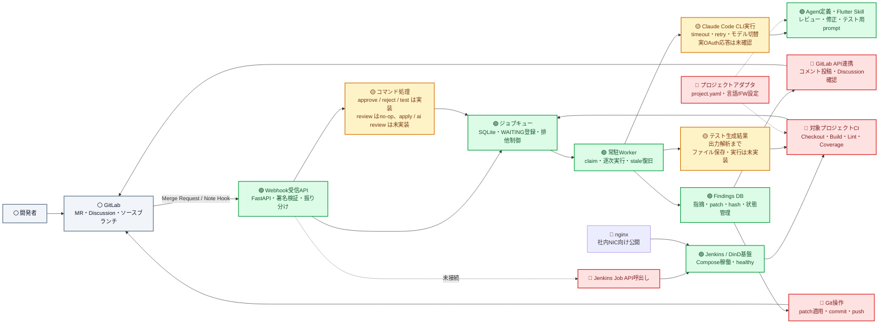
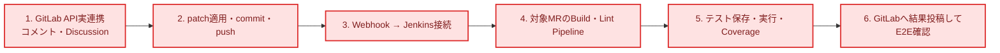

# AI Review Jenkins 進捗・コンポーネント関係図

**確認日:** 2026-07-29  
**判定基準:** 実装ファイル、Docker Compose の稼働状態、テスト結果、`Plan/全体アクションアイテム.md` を照合

## 凡例

- 🟢 **完了:** 主要機能が実装済みで、現在の構成で利用または検証できる
- 🟡 **一部実装:** 基本実装はあるが、実サービス接続または後続処理が未完成
- 🔴 **未実装:** 設計のみ、スタブのみ、または主要な接続がない
- ⚪ **外部:** このリポジトリの実装対象外の外部システム

## コンポーネント関係図

SVG版: [進捗・コンポーネント関係図](images/進捗_コンポーネント関係図.svg)

## 現在の到達点

| 領域 | 状態 | 確認できた内容 | 残作業 |
|---|---|---|---|
| DB・ジョブキュー | 🟢 完了 | `findings` / `job_queue`、Alembic、排他制御、stale復旧 | 運用監視・利用量カラムは将来対応 |
| Webhook受信 | 🟢 完了 | FastAPI、healthcheck、GitLabトークン検証、イベント振り分け | Webhookハンドラのテスト拡充 |
| コマンド処理 | 🟡 一部実装 | `/ai approve`、`reject`、`test` の基本処理 | `/review`本処理、`/ai apply`、`/ai review` |
| Worker・CLI | 🟡 一部実装 | 常駐Worker、CLI起動、timeout、retry、イベント別モデル指定 | 実OAuth応答によるE2E確認、失敗時のGitLab通知 |
| AI定義・プロンプト | 🟢 完了 | レビュー、修正確認、Flutterテスト生成用のAgent/Skill/Prompt | プロジェクトアダプタ化、トークン最適化 |
| GitLab連携 | 🔴 未実装 | ログ出力スタブのみ | MRコメント、Discussion Resolve確認、commit/push |
| Jenkins基盤 | 🟢 完了 | Jenkins、DinD、証明書、永続化、配布用イメージ | nginxによる社内公開 |
| 対象プロジェクトCI | 🔴 未実装 | 現在の`Jenkinsfile`は本リポジトリのPythonテストのみ | MR Checkout、Build、Lint、AI Review、Flutter Test、Coverage |
| テスト生成フロー | 🟡 一部実装 | CLI出力をテストファイル単位に解析 | ファイル書込、全テスト実行、結果・カバレッジ投稿 |
| プロジェクトアダプタ | 🔴 未実装 | 設計・計画のみ | `project.yaml`、設定注入、言語/FW別サンプル |

## 検証結果

- `jenkins`、`docker`、`webhook`、`worker` の4サービスがすべて `healthy`
- コンテナ環境で `Tests/` を実行し、**10件すべて成功**
- テストカバレッジは **44%**。Runner・Queue・Workerの主要部は検証済みだが、Webhookルーター／ハンドラ、GitLabスタブ、出力パーサー周辺は未検証箇所が多い

## 完成までのクリティカルパス

この経路がつながると、現在完成しているWebhook・Queue・Worker・CLI・DBを利用して、MR作成からレビュー／テスト結果返却までの最小E2Eフローが成立する。
