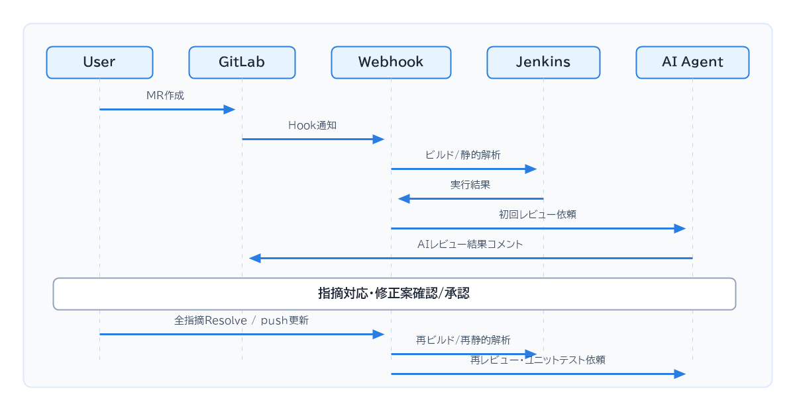

# AI Review Jenkins

GitLabのMerge Requestを起点に、JenkinsによるBuild/Lint、Claude CodeによるAIレビュー、
修正案の適用、テスト生成とカバレッジ通知を行うシステムです。Jenkins、専用Docker
daemon、Webhookサーバー、workerをDocker Composeで構成し、実行データと認証状態は
Docker named volumeへ永続化します。

環境を構築する場合は、
[CloneからAIレビュー実行までの初回導入手順](Doc/初回導入手順.md)に従ってください。

## 概要

[PDF版](Doc/企画書_要約スライド.pdf) / [Markdown版](Doc/企画書_要約スライド.md) /

## 主な機能

- MR作成時のBuild/LintとAIレビューの自動実行
- コード行に紐づく解決可能なGitLab Discussionの投稿
- ビルド失敗原因と修正案の通知
- 同一コミットのWebhook重複排除と、同一MR内の順次実行
- AI修正案の確認、承認、コミット
- テストの生成、実行、C0/C1カバレッジの通知
- Jenkins、DB、Claude Code認証情報の永続化

処理は次の順序で進みます。

MRコメントでは次のコマンドを利用できます。

| コマンド           | 動作                                       |
| ------------------ | ------------------------------------------ |
| `/ai review`     | AIレビューを手動実行                       |
| `/ai apply R1`   | 指摘`R1`の修正案を差分表示               |
| `/ai approve R1` | 指摘`R1`の修正をソースブランチへコミット |
| `/ai reject R1`  | 指摘`R1`を却下                           |
| `/ai test`       | テスト生成を手動実行                       |

## 構成

| コンポーネント | 役割                                                |
| -------------- | --------------------------------------------------- |
| `jenkins`    | Build/Lint/Test Pipelineの実行                      |
| `docker`     | Jenkinsジョブ専用のDocker-in-Docker daemon          |
| `webhook`    | GitLab Webhookの検証、Jenkins起動、コールバック受付 |
| `worker`     | キュー処理、Claude Code実行、GitLabへの結果投稿     |
| `agent-init` | DBマイグレーションとvolume初期化                    |

新規Jenkins環境では次のPipelineジョブが自動作成されます。

- `ai-review-build`: `jenkins/Jenkinsfile.build`
- `ai-review-test`: `jenkins/Jenkinsfile.test`

Build/Lint/Testに使用するコンテナイメージとコマンドは`.env`で変更できます。
リポジトリに含まれる初期値はFlutter Web向けですが、導入対象プロジェクトに合わせて
設定することを前提としています。

## ドキュメント

| 用途                                | ドキュメント                                                   |
| ----------------------------------- | -------------------------------------------------------------- |
| Clone後の初回構築と動作確認         | [初回導入手順](Doc/初回導入手順.md)                             |
| 日常的な起動、状態確認、ログ、停止  | [デモ環境の再開・停止手順](Doc/デモ環境_再開・停止手順.md)      |
| Claude Codeの認証とエージェント運用 | [CLIエージェント導入手順](Doc/CLIエージェント導入手順.md)       |
| GitLab.com向けWebhook公開           | [デモ版 Webhook外部公開方針](Doc/デモ版_Webhook外部公開方針.md) |
| Registry配布とオフライン移送        | [Jenkinsを別PCへ導入する手順](Doc/Jenkins_別PC導入手順.md)      |
| システムの内部設計                  | [技術設計書](Doc/技術設計書.md)                                 |
| 処理フロー                          | [シーケンス図](Doc/シーケンス図.md)                             |

## 現行仕様の注意点

- WebhookではMerge request eventsとNote eventsの両方を使用します。
- GitLab.com向けデモではWebhookポートを直接公開せず、ngrokのHTTPSトンネルを使用します。
- 最後のDiscussionを手動Resolveしても、GitLab.comから状態変更が通知されない場合があります。
  手動修正後は`/ai review`で確認し、問題がなければ`/ai test`を実行してください。
- 未解決の指摘がある状態で`/ai test`を実行すると、修正前コードを前提としたテストが生成
  される可能性があります。
- JenkinsからWebhookへのコールバックはCompose内部ネットワークだけを使用します。
- `docker compose down -v`はJenkins設定、DB、Claude認証などの永続データを削除します。

## セキュリティ上の構成

- Jenkins controllerは非rootユーザーで動作します。
- Docker操作はTLS接続された専用DinDサービスで実行します。
- DinDとJenkins inbound agent用ポートはホストへ公開しません。
- JenkinsとWebhookの公開先は初期値で`127.0.0.1`に限定しています。
- GitLab、Jenkins、Claudeのトークンは`.env`または専用Docker volumeで管理し、
  リポジトリには含めません。
